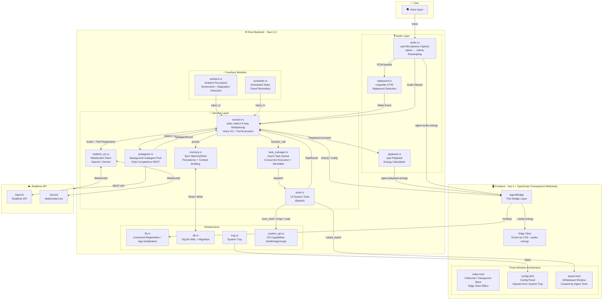

# Agent3 — Project Handoff Document

> **Inspiration**: The movie "Her" — an invisible, ambient system-level AI agent
> **Tech Stack**: Tauri 2.0 + Vue 3 + TypeScript + Rust + SQLite + Realtime API + cpal + rodio + rustpotter
> **Last Updated**: 2026-03-21

---

## 1. Project Vision & Design Philosophy

This project aims to create a **system-level ambient AI agent**, based on three core principles:

1. **Zero-Protocol**: Users do not need any UI operations to interact with the AI — they can just dialogue using voice. The main window is a full-screen, transparent, click-through "AR foundation canvas" without the concept of traditional interfaces.
2. **Capability Introspection**: The AI can autonomously probe and manipulate the operating system — viewing processes, executing commands, controlling the keyboard and mouse, and browsing the file system. All atomic OS capabilities are exposed as Function Calling tools.
3. **Ephemeral Presence**: All visual feedback is physically driven and transient (e.g., the boundless Edge Glow at the bottom of the screen), rendering with minimalist composite DOM layers to minimize GPU overhead. Visuals surge with the AI's voice and fade into nothingness when silent.

---

## 2. Project Architecture

### 2.0 Architectural Overview



### 2.1 Three-Window / Multi-Page Architecture

```text
index.html (Main Window "Fullscreen Transparent Base" — Fullscreen pure transparency, no border/always-on-top/click-through/skip-taskbar)
├── src/main.ts → src/App.vue
│   ├── EdgeGlow (Boundless ambient edge glow — Pure CSS composite layer physics effect)
│   ├── Ghost Terminal (Subagent state floating layer — Bottom left semi-transparent log, auto-fades in 8s)
│   └── AgentBridge (Thin bridge layer — Event listening, energy-driven Edge Glow)

board.html (Whiteboard Window — 640×520, Dynamically created/invoked by Agent tools, manually closed by user)
├── src/board/main.ts → src/board/BoardApp.vue
│   └── Content display area (text / code / html) + Close button

config.html (Config Window — Standard window with border, opened from system tray)
├── src/config/main.ts → src/config/ConfigApp.vue
│   └── Two-tab config panel: General (Agent name/Wakeword) / 🎙 Voice Service (provider)
```

### 2.2 Rust Backend Modules — Two-Layer Collaboration Architecture

```text
src-tauri/src/
├── main.rs          — Tauri entry point
├── lib.rs           — Command registration, app initialization, lifecycle start/stop
├── db.rs            — SQLite persistence (PRAGMA user_version migration system)
├── system_api.rs    — OS capability module (exec_shell + enigo + xcap)
├── tray.rs          — System tray (Settings / Quit)
└── agent/           — Agent core (Fat Daemon)
    ├── mod.rs           — AgentState + start_all/stop_existing + agent commands
    │
    │   ┌─── Audio Layer (Native Capture + Playback + Wakeword) ───┐
    ├── audio.rs         — cpal mic capture + wake state machine + rustpotter detection + resampling + base64 encoding
    ├── playback.rs      — cpal audio playback + energy calculation (std::thread holds cpal Stream)
    ├── wakeword.rs      — Wakeword model management: Record samples + DTW training + CRUD + activation
    │   └───────────────────────────────────────────┘
    │
    │   ┌─── Session Layer (Voice I/O + Tool Execution + Memory Persistence) ───┐
    ├── session.rs       — Voice I/O + direct tool execution: Wake wait + WS connection + tokio::select! 6-way multiplexing
    ├── memory.rs        — Sync MemoryStore: Conversation persistence + system instructions building + context retrieval
    ├── realtime_ws.rs   — Multi-Provider WebSocket Client (OpenAI + Gemini), RealtimeProtocol trait
    ├── task_manager.rs  — Async task queue (Concurrent execution, 3s filler speech, abortable)
    ├── subagents.rs     — Background subagent pool: Chat Completions REST loop, ask_user suspend/resume, isolated toolset
    ├── tools.rs         — System instructions + 13 tool definitions + dispatch (called by task_manager / subagent)
    │   └────────────────────────────────────────┘
    │
    │   ┌─── Auxiliary Modules ───┐
    ├── ambient.rs       — Ambient perception (optional): Screenshot + stagnation detection + HTTP LLM analysis
    └── scheduler.rs     — Scheduled tasks: Timed reminders, Agent self-scheduled tasks
        └─────────────────┘
```

### 2.3 Session + MemoryStore Architecture — Core Design

```text
                     ┌──────────────┐
                     │ User (Voice) │
                     └──────┬───────┘
                            │
              ┌─────────────▼─────────────┐
              │ Session Layer (session.rs)│  Realtime API WebSocket
              │ · Voice Capture/Playback  │  · Registers all 13 tools
              │ · Direct tool execution   │  · Auto 3s reconnect
              │ · task_manager concurrency│  · Supports OpenAI + Gemini
              │ · Holds SubagentManager   │  · Injects context on reconnect
              │ · Directly holds MemoryStore│· subagent_event_rx multiplexing
              └──────┬──────────▲─────────┘
    persist()        │          │  inject_rx
  (user/assistant/   │          │  (String channel)
   tool transcripts) │          │
              ┌──────▼──────────┴─────────┐
              │ memory.rs (MemoryStore)   │  Sync struct (Non-async task)
              │ · transcript → SQLite     │  · Builds system instructions
              │ · Long-term load + decay  │  · Reconnect context retrieval
              └───────────────────────────┘
              
              inject_tx channel:
              ambient.rs → inject_tx → session (inject_rx)
              scheduler.rs → inject_tx → session (inject_rx)

              ┌──────────────────────────────┐
              │ subagents.rs (SubagentMgr)   │  tokio::spawn independent tasks
              │ · Chat Completions REST loop │  · Reuses tools.rs toolset
              │ · ask_user: oneshot suspend  │  · SubagentEvent → session
              │ · 25 max rounds, auto-cleanup│  · abort_all() tied to session stop
              └──────────────────────────────┘
              session ←→ SubagentManager:
              spawn_subagent → subagent_mgr.spawn() → tokio task
              reply_to_subagent → subagent_mgr.reply() → oneshot resume
              subagent_event_rx → inject voice (AskUser/Completed/Failed)
```

**Why this design?**
- Realtime API (OpenAI/Gemini) natively supports function calling → Tools are registered directly on the WS session.
- MemoryStore is a synchronous struct directly held by the Session — SQLite WAL writes take <1ms, eliminating the need for a channel.
- Removed the old Orchestrator implementation/file to eliminate dead-code drift; Session + MemoryStore now own that responsibility directly.
- ambient/scheduler inject directly into the session via a simple String channel without a routing middleware layer.
- Recent dialogue context is injected upon reconnect (`conversation.item.create`), effectively fixing "amnesia upon reconnection".
- SubagentManager runs independently of the Realtime WS — using a REST Chat Completions loop to not block voice dialogue.
- Subagents inject verbal outcomes via MPSC → session (AskUser/Completed/Failed), following the `inject_tx` pattern.
- `ask_user` uses oneshot channels to suspend/resume; users answer verbally naturally → Voice AI calls `reply_to_subagent` to forward the response.
- Subagent toolset excludes `spawn_subagent` to prevent recursive generation, and excludes `observe_screen` to prevent token explosion.

### 2.4 Data Flow (Voice + Tool Pipeline)

```text
User speaks
  → Native cpal capture (16kHz mono PCM i16)               [Rust cpal]
    → rustpotter wake detection (always runs in Sleeping)  [audio.rs + rustpotter DTW]
    → Resample 16→24kHz + base64 encode                    [audio.rs]
      → mpsc channel → session audio_rx                    [Rust channels]
        → realtime_ws (tokio-tungstenite WebSocket)        [Rust network layer]
          → Realtime API (server_vad automatically detects sentence boundaries)

Model replies (Session layer replies directly)
  ← response.audio.delta (PCM16 base64)
    → PlaybackCommand::Enqueue → playback.rs (cpal Stream) [Rust playback]
    → Playback energy → emit("agent-playback-energy") → Edge Glow [Visual sync]
  ← transcript (user/assistant text)
    → emit("agent-transcript") → Show in Frontend          [UI display]
    → memory.persist() → SQLite persistence                [MemoryStore sync write]
  ← agent-audio-energy (f32)                               [Rust → Frontend]
    → CSS --audio-energy variable → Edge Glow effect       [Visual drive]

When tools are needed (Session layer handles directly)
  Realtime API returns function_call
    → session accumulates pending_tool_calls (ResponseDone triggers batch submit)
    → task_manager.submit() concurrent execution           [Task Scheduling]
      → tools::dispatch_tool() / dispatch_ui_tool()        [Tool Execution]
      → TaskResult → function_call_output sent to WS       [Result Return]
    → Realtime API → Model spontaneously synthesizes speech based on tool results [User hears]

User interruption detection
  ← input_audio_buffer.speech_started (server VAD event)
    → task_mgr.abort_all() interrupts running tools        [Cancel running tools]
    → clears pending_tool_calls                            [Clear pending queue]

Background Subagents (subagents.rs)
  spawn_subagent tool call (Initiated by Voice AI, bypasses task_manager)
    → SubagentManager.spawn(goal) → tokio::spawn isolated task [Returns task_id immediately]
    → Chat Completions REST loop (max 25 rounds)           [Independent HTTP API]
      → Reuses tools.rs toolset (excludes spawn_subagent/reply_to_subagent/observe_screen/schedule_task)
      → ask_user tool: oneshot suspend → SubagentEvent::AskUser → voice injects question
      → User verbally replies → voice AI calls reply_to_subagent → oneshot resume
    → Completed/Failed → SubagentEvent → voice injects result summary
    → session stops triggers subagent_mgr.abort_all()      [Lifecycle binding]

  Frontend Ghost UI (App.vue)
    ← subagent-log event → bottom-left semi-transparent terminal [pointer-events: none]
    → Displays recent 10 logs (task_id + status + message) [Auto-fades out if inactive for 8s]
```
